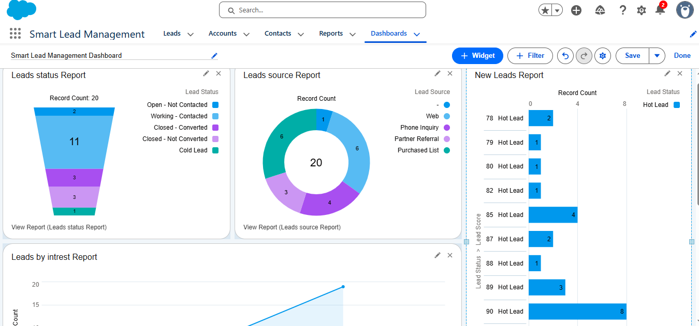
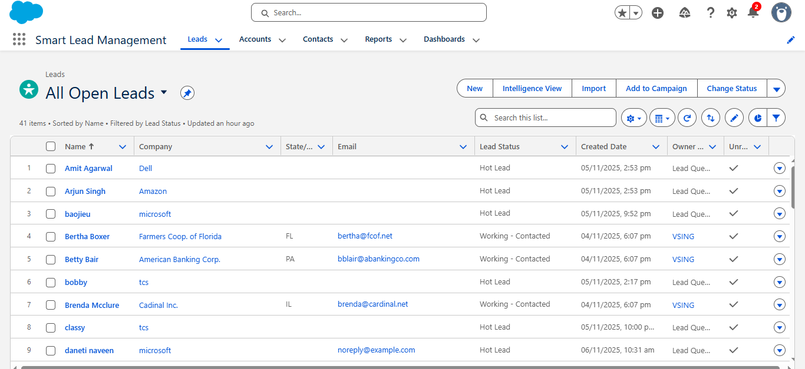

# Smart Lead Management System (Salesforce Project)

This project automates the process of capturing, managing, and tracking leads using Salesforce CRM.  
It includes an integrated Web-to-Lead form, intelligent email alerts, and visual dashboards for lead analysis.

---

## 🌐 Live Demo
[Click here to test the live form](https://YOUR-GITHUB-USERNAME.github.io/smart-lead-management-system/)

---

## ⚙️ Features
- Web-to-Lead integration
- Lead Scoring and Status Automation
- Email Alerts for Hot Leads
- Queue-based Lead Assignment
- Dashboards and Reports for Visualization
- Deployed using GitHub Pages

---

## 📄 Documentation
The complete project documentation can be found in  
`Project_Documentation.docx`.

---

## 📸 Screenshots

---

### 🧑‍💻 Author
**Vinay Singu**  
Aspiring Salesforce Developer | ISRO Enthusiast

